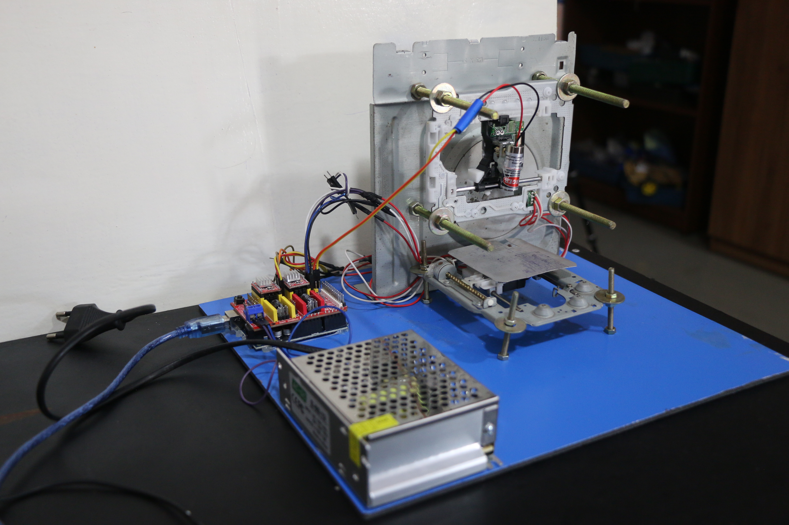
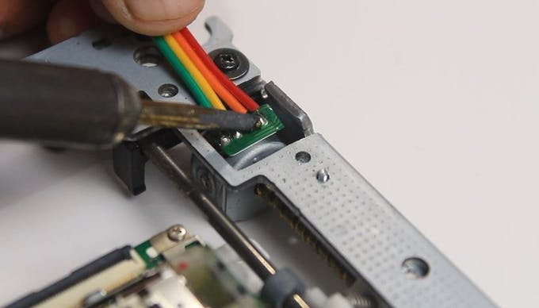
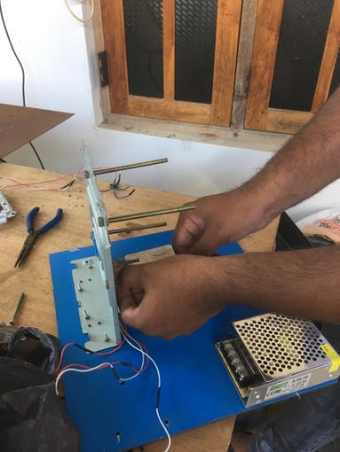
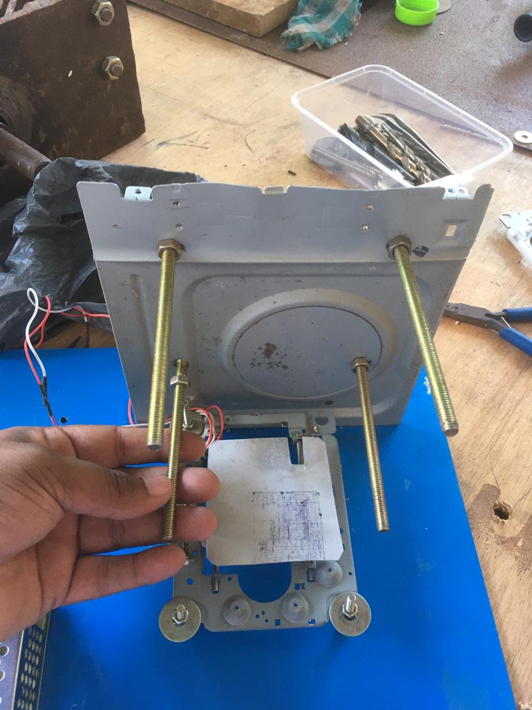
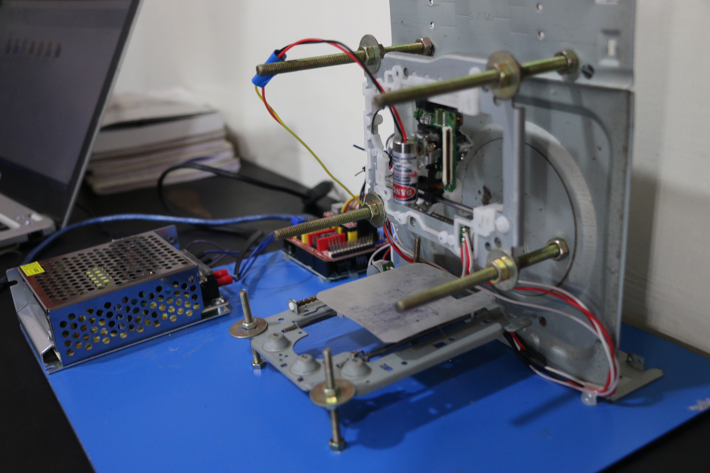

# CNC Laser Plotter Machine

## How to Smake Arduino mini CNC plotter machine

Hello friends, in this post we will see how to make a mini CNC plotter machine using an old scrap DVD drive, Arduino and CNC v3 shield.In fact in the past I have built some Arduino mini CNC plotter machines or drawing machines in the past.But those projects are not well documented and unclear so I got many request to make a detail in depth tutorial about how to make Arduino basic mini CNC plotter machine.So in this post l am going to cover all points like hardware assembly ,code for Arduino, G-code generation etc.So before moving further let me brief you about what is the CNC plotter machine is

  

### Material list 
1. Arduino UNO - 1
2. CNC shield - 1
3. a4988 stepper motor driver - 3
4. mini servo motor -1
5. 12v - 2amps power supply
6. scrap DVD drive - 3
7. some wires for motor connection
8. Nut and bolts.

### Software list 
1. Arduino IDE
2. Universal G-code controller
3. Inscape version

### Step 1.

To make Arduino based mini CNC plotter machine obviously we need two scrap DVD drive I purchased this drive from my local computer.we’ll going to use its stepper motor along with sliding mechanism here note that not all DVD drives have stepper motors in it. If the motor has 4 wires it means it is a stepper motor.

### Step 2.

Then I bring some DuPont 4 wire of around 40 cm and cut it into 2 pieces one for each stepper motor connection.
Then I strip the wire carefully without damaging the copper strain of wire.and solder it to the expose terminals of stepper motor

### Step 3.

Here I have paint the the empty case of DVD drive using gray shade spray paint, this step is not compulsory its ok if you don’t want to paint them

  

After drilling the hole in the DVD drive case I fixed the four M4 X 60 nut bolts at the four corners of the stepper motor mechanism.Now I placed the stepper motor mechanism in its place and secured all four bolts with M4 nuts.

### Step 4

The CNC motor shield is mounted on an Arduino UNO.In this way assembly of Arduino CNC plotter machine is completed now we will see the wiring

